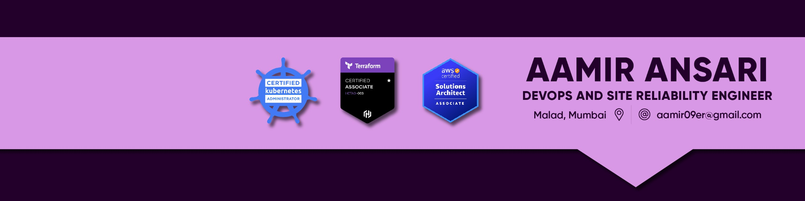

   
 

  

<h1 align="center">Hi 👋, I'm Aamir Ansari</h1>
<h3 align="center">I'm a DevOps and cloud enthusiast with a passion for automating and streamlining development, deployment, and operations processes.</h3>

  

- 🔭 I’m currently working on **media.net as SysOps engineer**

- 🌱 **I’m continuously learning about the latest DevOps practices and cloud technologies.**

- 💬 Ask me about **DevOps,AWS EKS, cloud computing, CI/CD, Docker, Terraform,Ansible, Infrastructure Planning and more!**

- 📫 How to reach me **aamir09er@gmail.com**

<h3 align="left">Connect with me:</h3>

<h3 align="left">Languages and Tools:</h3>

                 

&nbsp;

