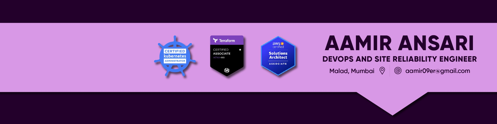

   
 

  

<h1 align="center">Hi 👋, I'm Aamir Ansari</h1>
<h3 align="center">I’m a Site Reliability Engineer and cloud enthusiast with a passion for automating workflows, production deployment, and operations processes.</h3>

  

- 🔭 I’m currently working on **CloudBees as Site Reliability Engineer on SAAS Platform team**

- 🌱 **I’m continuously learning about the latest DevOps/SRE practices and infrastructure planning.**

- 💬 Ask me about **Site Reliability Engineer/DevOps,AWS EKS, cloud computing, CI/CD, Docker, Terraform,Ansible, Infrastructure Planning and more!**

- 📫 How to reach me **aamir09er@gmail.com**

<h3> Experience</h3>

Site Reliability Engineer / DevOps Engineer with 4+ years of hands-on experience managing large-scale production infrastructure across AWS, Kubernetes, and hybrid environments. Experienced in building reliable, scalable, and highly available cloud-native platforms with a strong focus on automation, observability, incident response, and infrastructure optimization.

Currently managing and provisioning AWS EKS-based SaaS platforms, ensuring platform reliability, scalability, and operational efficiency across production environments. Skilled in Kubernetes operations, Helm-based deployments, troubleshooting distributed systems, and managing stateful workloads such as Cassandra with robust backup and recovery strategies.

Experienced in implementing Infrastructure as Code using Terraform and automating operational workflows through Bash, Python, Puppet, and Ansible. Worked extensively with CI/CD pipelines using Tekton, Jenkins, GitLab CI/CD, and GitHub Actions to streamline deployments and improve engineering productivity.

Strong background in observability and monitoring using Datadog, FluentBit, Prometheus, ELK Stack, Pingdom, and AWS OpenSearch for centralized logging, alerting, and incident analysis. Focused on reducing alert noise, improving visibility, and maintaining high platform uptime.

Hands-on experience with HashiCorp Vault for secrets management, Consul Service Mesh for internal service communication, and NATS architecture for distributed messaging and system reliability.

Previously managed large-scale Proxmox clusters and highly available VM infrastructure, including node supervision, ZFS/ZPool-based storage management, and infrastructure capacity planning. Experienced in maintaining both Linux and Windows server environments, including Active Directory, GPO policies, networking, and security hardening.

Strong knowledge of AWS networking and cloud infrastructure, including VPCs, subnets, routing, IAM permissions, EC2, S3, Lambda, and boto3 automation scripting. Skilled in troubleshooting production incidents, optimizing infrastructure costs, improving deployment reliability, and automating repetitive operational tasks.

Passionate about platform engineering, cloud infrastructure, Kubernetes, automation, and building resilient systems that scale efficiently in production environments.

<h3 align="left">Connect with me:</h3>

<h3 align="left">Languages and Tools:</h3>

                 

&nbsp;

