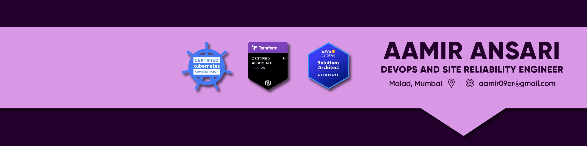

   

  

<h1 align="center">Hi 👋, I'm Aamir Ansari</h1>
<h3 align="center">Site Reliability / DevOps Engineer in Mumbai — AWS, Kubernetes, Terraform, and production infrastructure for trading and SaaS.</h3>

  

- 🔭 I’m currently **Assistant Manager, DevOps Engineering at Ventura Securities** — AWS, nginx, and CloudFront for a ~30-microservice brokerage trading platform
- 🌱 Previously **SRE at CloudBees** (EKS SaaS) and **DevOps at Media.net** (Proxmox / Kubernetes)
- 💬 Ask me about **SRE/DevOps, AWS EKS, Helm, Terraform, CI/CD, Datadog, incident response, and platform reliability**
- 📫 How to reach me **aamir09er@gmail.com**
- 📄 Resume / portfolio labs: [kubernetes-observability-lab](https://github.com/aamir09er/kubernetes-observability-lab) · [devsecops-k8s-lab](https://github.com/aamir09er/devsecops-k8s-lab) · [ai-incident-intelligence](https://github.com/aamir09er/ai-incident-intelligence)

<h3>Experience</h3>

Site Reliability / DevOps Engineer with **4.5+ years** building and operating cloud-native production systems, including **real-time trading and financial-services** infrastructure and **multi-tenant SaaS**. Specialized in **AWS, Kubernetes, Terraform, and CI/CD**, with a track record of reducing MTTR, cutting infra cost, and automating operational work.

**Ventura Securities** (Jun 2026 – Present) — Assistant Manager, DevOps Engineering. Own AWS, nginx routing, and CloudFront for a ~30-microservice trading stack (C++ / Node.js, Flutter) at a brokerage operating since 1994. Fixed a production/DR nginx region mismatch, cut latency by moving static images to CloudFront, and run Jenkins / GitHub Actions pipelines with rolling and blue-green production deploys.

**CloudBees** (2024 – 2026) — Site Reliability Engineer. Provisioned AWS EKS for 3+ production SaaS environments (single-tenant and multi-tenant). Terraform and CloudBees Unify cut deployment time ~30%. Led zero-downtime EKS v1.34 upgrades and Amazon Linux 2023 node groups. GitHub Actions and Tekton for daily deploys; Helm, Helmfile, and Karpenter for 30+ apps. Datadog SLA/SLO dashboards and EKS log filtering — 99.9% observability and ~10% cost reduction. Lambda + SQS incident routing cut alert noise ~60%. Vault for secrets; Cassandra, RDS, and OpenSearch right-sizing (~15% cost). On-call; ~20% lower MTTR via runbooks.

**Media.net** (2022 – 2023) — DevOps Engineer. 80+ Proxmox hosts and 100+ VMs at 99.9% uptime. Puppet, Bash, and Python for provisioning. Prometheus and Icinga2 for faster detection. Jenkins, GitLab, and Argo CD for Kubernetes. Linux/Windows, networking, RCA.

Also: migrated AWS Terraform (HCL) to Go-based tooling with AWS SDKs; Datadog RUM and SLI/SLO observability with event correlation.

<h3>Certifications</h3>

- Certified Kubernetes Administrator (CKA)
- AWS Certified Solutions Architect – Associate
- HashiCorp Certified: Terraform Associate (003)
- GitHub Actions Certification (GH-200)

<h3 align="left">Connect with me:</h3>

<h3 align="left">Languages and Tools:</h3>

  
  
  
  
  
  
  
  
  
  
  
  
  
  
  
  
  

&nbsp;

